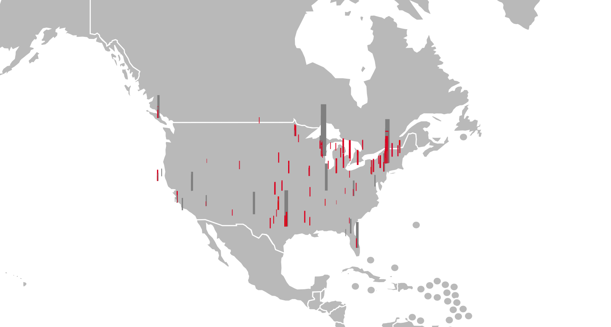

# Bootcamp-DataPhys

Cleaned datasets from : https://corgis-edu.github.io/corgis/csv/skyscrapers/
Used in the Bootcamp *Data physicalisation* that happended at EM Lyon.

This dataset is representing the number and height of skyscrapers built in the US throughout the years.

## Dataset used in Tableau Public

## Dataset used in SVG5 
Find out more about SVG5 here :: https://github.com/MAKIO135/svg5.js 

